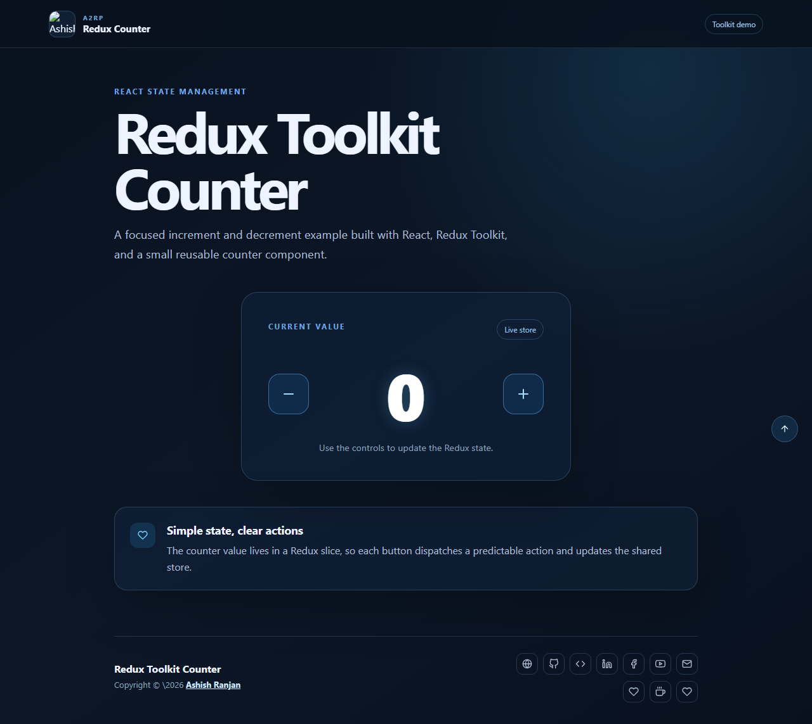

# Redux Toolkit Counter

A focused React counter application that demonstrates predictable increment and decrement actions with Redux Toolkit.

## Features

- Increment and decrement controls
- Redux Toolkit slice and store setup
- Accessible icon buttons and live counter output
- Responsive layout with local branding
- GitHub Pages deployment

## Tech stack

React, Redux Toolkit, React Redux, React Icons, and Create React App.

## Run locally

~~~bash
npm install
npm start
~~~

Build and deploy:

~~~bash
npm run build
npm run deploy
~~~

## Links

- Live: [https://a2rp.github.io/react.js-redux-toolkit-increment-decrement/](https://a2rp.github.io/react.js-redux-toolkit-increment-decrement/)
- Repository: [https://github.com/a2rp/react.js-redux-toolkit-increment-decrement](https://github.com/a2rp/react.js-redux-toolkit-increment-decrement)
- Portfolio: [https://www.ashishranjan.net/](https://www.ashishranjan.net/)
- GitHub: [https://github.com/a2rp](https://github.com/a2rp)
- CodePen: [https://codepen.io/ash1198](https://codepen.io/ash1198)
- LinkedIn: [https://www.linkedin.com/in/aashishranjan](https://www.linkedin.com/in/aashishranjan)
- Facebook: [https://www.facebook.com/theash.ashish/](https://www.facebook.com/theash.ashish/)
- YouTube: [https://www.youtube.com/@ashishranjan-ashz?sub_confirmation=1](https://www.youtube.com/@ashishranjan-ashz?sub_confirmation=1)
- Email: [ash.ranjan09@gmail.com](mailto:ash.ranjan09@gmail.com)

## Support

- [Support](https://a2rp-donation-page.netlify.app/)
- [Buy Me a Coffee](https://buymeacoffee.com/a2rp)
- [Patreon](https://patreon.com/a2rp)

Copyright © 2026 [Ashish Ranjan](https://www.ashishranjan.net/)
